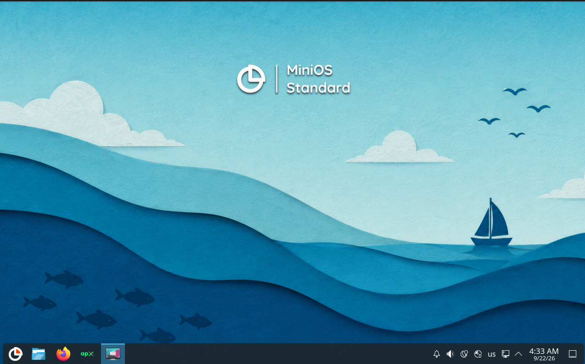

# 



MiniOS is a reliable and user-friendly portable system with a graphical interface. These scripts build a bootable MiniOS ISO image.

## 🌐 Resources

Learn more about using and building MiniOS:

### 🖥️ Official Website

The [official website](https://minios.dev) is your central hub for information about MiniOS.  Find details on the different editions available, their respective features, community forums for support, and direct download links for the ISO images.

### 📚 Official Wiki

The [official Wiki](https://github.com/minios-linux/minios-live/wiki) provides in-depth knowledge and practical guidance for working with MiniOS. Explore comprehensive guides covering installation procedures, system configuration, customization options, and how to extend functionality with modules.

### 🚀 Quick Start Guide

New to MiniOS? Start with our comprehensive [Quick Start Guide](https://github.com/minios-linux/minios-live/wiki/Quick-Start) that covers everything from choosing the right edition to setting up security and customizing your system. Perfect for beginners and experienced users alike.

**Note:**

* For information on building MiniOS and modifying modules, read the [Building MiniOS Guide](https://github.com/minios-linux/minios-live/wiki/Building-MiniOS).

## ✍️ Authors

MiniOS was created by:
- [crims0n](https://github.com/crim50n) - the original author and maintainer of MiniOS
- [.nemesis](https://github.com/zukhovich) - designer and developer of the MiniOS graphical interface
- [FershoUno](https://github.com/fershouno) - tester and contributor to the MiniOS project
- [sfs-pra](https://github.com/sfs-pra) - developer of the PuppyRus Linux and contributor to the MiniOS project
- [betcher](https://github.com/betcher) - developer of the ROSA Barium and contributor to the MiniOS project
- [gumanzoy](https://github.com/gumanzoy) - developer of the PocketHandyBox and contributor to the MiniOS project
- [xDoofy92](https://github.com/xDoofy92) - media support for the MiniOS project

## 🔀 About This Fork

This fork builds MiniOS on Debian 14 (forky) with the KDE Plasma desktop and ships the Apx container-based package manager alongside it. It keeps everything that makes MiniOS what it is — a portable, live-bootable system that runs from a USB stick and remembers your changes — and pairs it with a full-featured desktop and a way to install software from other Linux distributions without touching the base system.

What you get:

- **A current Debian base.** Built on Debian 14, so the kernel, drivers and applications are recent.
- **KDE Plasma.** A complete, polished desktop with the MiniOS look, booting straight to the desktop as a live user.
- **Apx.** Install packages from Debian, Fedora, Arch, Alpine and others in isolated containers; they show up as ordinary applications while the live system stays clean.
- **MiniOS tooling.** The installer, module manager, store, kernel manager and the rest of the MiniOS utilities are all present.

Upstream MiniOS remains the reference project; this fork tracks it and only adds what is described above.

## 🪟 Building on Windows with Debian WSL

You do not need a Linux machine to build this. Windows can run Debian inside itself (WSL), and the repository ships a helper script that does the rest.

**1. Install Debian from the Microsoft Store**

Open the Microsoft Store, search for **Debian**, and install it. Launch it once from the Start menu; it will ask you to pick a username and password. You can close it afterwards.

If launching it complains that WSL is not enabled, open PowerShell as Administrator, run `wsl --install`, reboot, and try again.

**2. Get this repository onto your PC**

Either use GitHub Desktop / `git clone`, or click **Code → Download ZIP** on GitHub and unzip it. Any folder is fine, for example `C:\Users\you\Documents\GitHub\minios-live`.

**3. Prepare Debian (once)**

Open PowerShell or Windows Terminal and run the command below, replacing the path with wherever you put the repository. Note that Windows paths are written as `/mnt/c/...` here:

```powershell
wsl -d Debian -u root -- bash /mnt/c/Users/you/Documents/GitHub/minios-live/tools/wsl-build.sh setup
```

This installs the build tools inside Debian. You only need to do it the first time.

**4. Build the ISO**

```powershell
wsl -d Debian -u root -- bash /mnt/c/Users/you/Documents/GitHub/minios-live/tools/wsl-build.sh build -
```

This takes a while (30 minutes to a couple of hours depending on your PC and internet connection) and needs around 20 GB of free space on your Windows drive. Leave the window open until it says the image has been created.

**5. Copy the ISO to Windows**

```powershell
wsl -d Debian -u root -- bash /mnt/c/Users/you/Documents/GitHub/minios-live/tools/wsl-build.sh fetch-iso
```

The finished `.iso` appears in a `build-output` folder inside the repository. Write it to a USB stick with [Rufus](https://rufus.ie) or [Ventoy](https://www.ventoy.net), or boot it in a virtual machine.

**Good to know**

- Building again after a change is faster: parts that have not changed are reused.
- `wsl-build.sh clean` removes the whole build area inside Debian if you want to start fresh.
- Do not run the build from inside a Windows folder in Debian directly; the helper script takes care of copying the files to where Debian can build them.
